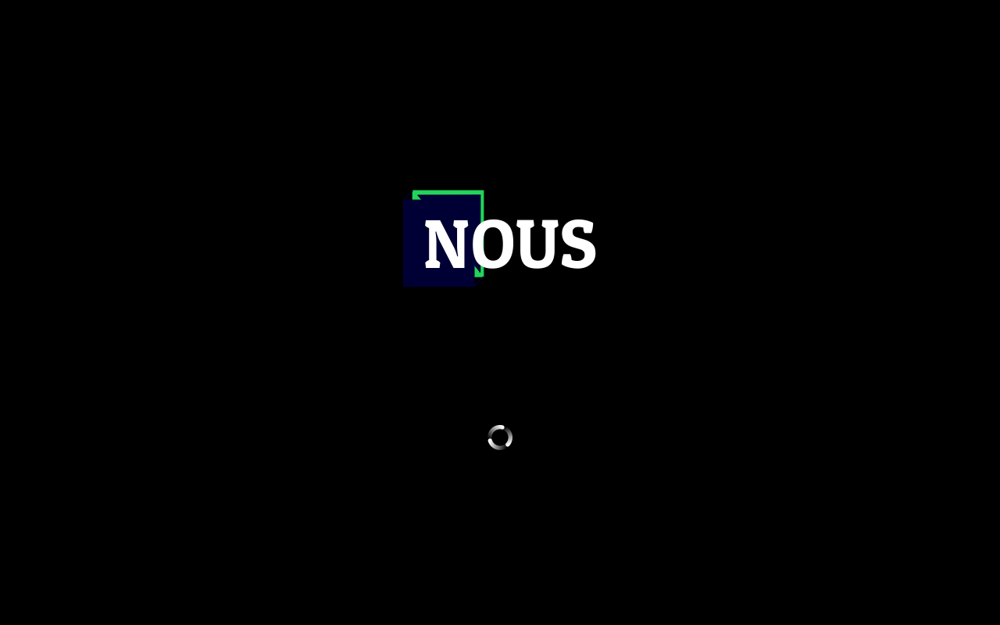
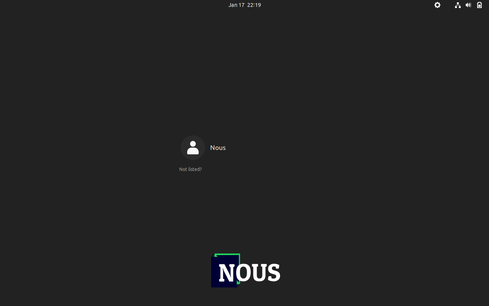
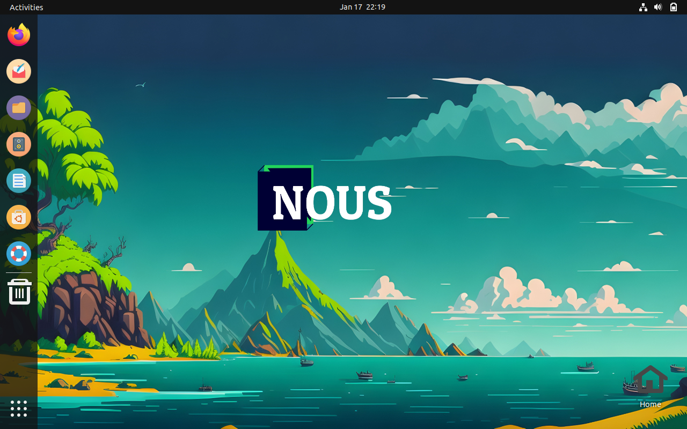
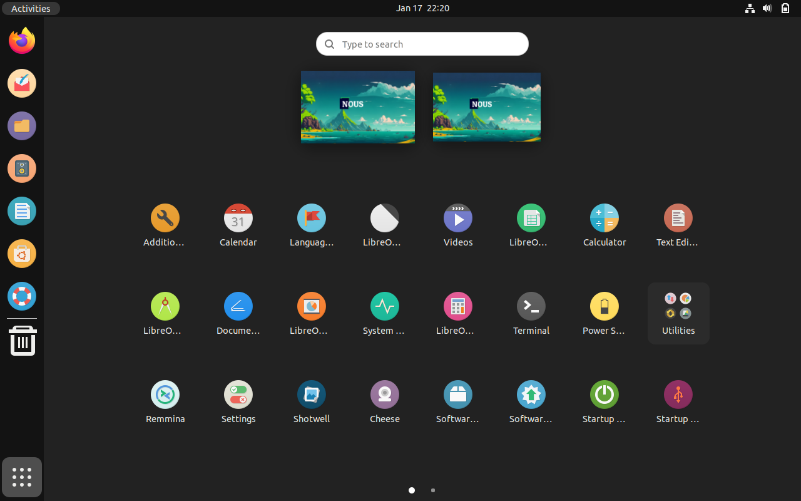
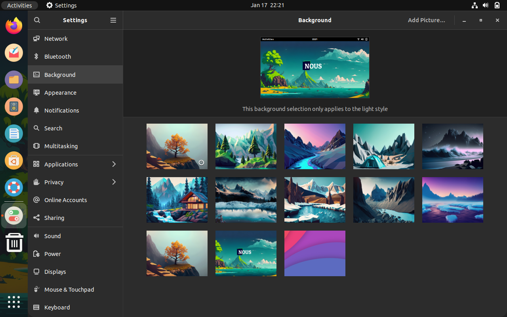
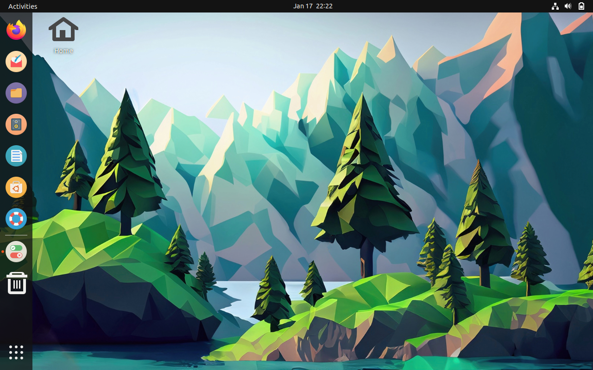
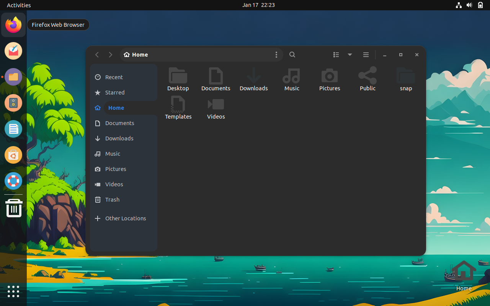

# Linux Ubuntu Nous

Nous mengusung tema library dengan nuansa alam ke dalam Nous supaya pengguna merasakan vibes membaca diluar ruangan khususnya alam. Alasan lainnya yaitu agar pengguna juga tidak merasakan bosan atau monoton menggunakan Nous jika kami hanya benar-benar mengaplikasikan tema library pada umumnya tanpa adanya modifikasi atau hal baru dalam tema tersebut

## Tentang

Proyek ini adalah hasil dari remastering Ubuntu, dirancang untuk memenuhi kebutuhan khusus atau untuk menyediakan pengalaman pengguna yang disesuaikan. Berikut adalah beberapa fitur utama:

- [x] **Custom Package Installations**: Menyertakan paket perangkat lunak khusus yang tidak ada dalam distribusi standar Ubuntu.
- [x] **Custom Desktop Environment**: Pengaturan tema dan konfigurasi khusus untuk menciptakan tampilan yang unik.
- [x] **Optimizations**: Penyesuaian dan optimalisasi sistem untuk kinerja yang lebih baik.

##Tampilan

Berikut contoh tampilan dalam Nous

## Persyaratan Sistem

- [Ubuntu 22.04](https://ubuntu.com/download/desktop)
- 2 GHz dual-core processor atau lebih baik
- 4 GB system memory
- 25 GB of free hard drive space

## Cara Menggunakan

1. **Unduh ISO**: Unduh file ISO remastering dari [drive](https://drive.google.com/drive/folders/1owyS4D76JsUXsZBVWbGtCI_L146lFOA9).
2. **Burning ke Media**: Bakar ISO ke DVD atau buat USB bootable.
3. **Instalasi**: Instalasi pada komputer atau mesin virtual sesuai dengan prosedur instalasi Ubuntu biasa.

## Kolaborator

[Ridwan Dwi Irawan] email : ridwan_dwiirawan@udb.ac.id 

## Kontak

Jika Anda memiliki pertanyaan atau saran, hubungi:
- [Edwin Pavel Ekapagliuca] melalui 230103098@mhs.udb.ac.id
- [Jibran Ma’ruf] melalui 230103105@mhs.udb.ac.id
- [Varel Deva Dewangga] melalui 230103120@mhs.udb.ac.id
                                                  

